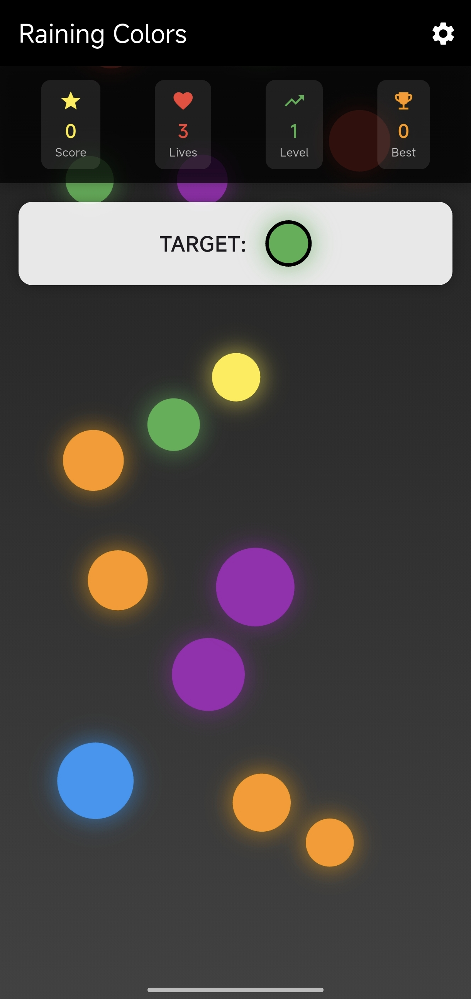
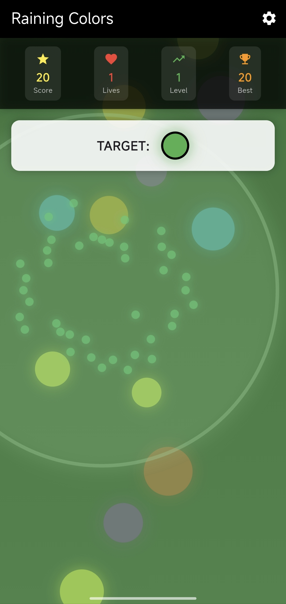

# Raining Colors

A vibrant, fast-paced Flutter mobile game developed for Android where players test their reflexes by popping falling circles.

## Overview

**Raining Colors** is a casual, reflex-based arcade game built using the Flutter framework. Colorful circles cascade down the screen like rain, and players must quickly identify and tap only the specific target color designated by the game. The project features clean state management, cross-device rendering configurations, and optimized touch inputs natively built for Android devices.

## Features

- **Dynamic Color Matching:** Continuously updates the target color objective, demanding rapid cognitive recognition and precision tapping.
- **Fluid Falling Physics:** Smooth, frame-rate optimized animation configurations that handle multiple falling circle entities concurrently.
- **Native Android Integration:** Dedicated deployment settings ensuring seamless responsiveness across various mobile screen sizes and aspect ratios.
- **Clean Architecture:** Separated configuration layers using standard `pubspec.yaml` setups and strict static code analysis rules via `analysis_options.yaml`.

## Screenshots

### Main Gameplay


_Figure 1: Active game loop demonstrating falling circle elements and the color target tracking system._

### Visual Effects


_Figure 2: Popping colors visual effects demonstration_

## Tech Stack

- **Framework:** Flutter
- **Language:** Dart
- **Target Platform:** Android (Fully configured Gradle environment)

## Project Structure

```bash
raining-colors/
├── android/               # Native Android build folders, Gradle configurations, and app manifests
├── assets/                # Audio components, custom fonts, and graphical visual assets
├── lib/                   # Core Dart codebase containing UI components, logic, and layout files
├── .gitignore
├── .metadata
├── README.md
├── analysis_options.yaml  # Linter rules and static analysis configurations
├── game.iml
└── pubspec.yaml           # App dependencies, asset mapping, and metadata configuration
```

## Installation

- git clone https://github.com

- Ensure you have the **Flutter SDK** and **Android Studio / Android SDK** configured locally

- Navigate to the root directory and fetch the necessary package dependencies: `flutter pub get`

- Connect a physical Android device or boot up an emulator instance

- Build and launch the mobile application: `flutter run`

## Author

H2SO4-1191 – Software Engineer
